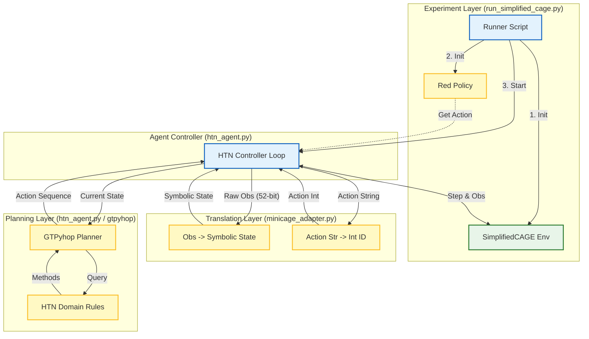

-orange)


## Project Overview
This repository implements an autonomous **Blue Agent** for the **CybORG CAGE Challenge 2** (Cyber Autonomy Gym for Experimentation). 

Unlike standard Reinforcement Learning (RL) agents that learn policies via trial-and-error, this agent utilizes **Hierarchical Task Network (HTN) Planning** via the `gtpyhop` library. It decomposes high-level defense goals (e.g., "Secure Network") into primitive cyber actions based on a rigorous priority hierarchy.

The agent features a **"Lazy Lookahead" Controller**, allowing it to balance the computational cost of replanning against the need to react to dynamic Red attackers (e.g., *Meander*, *B_line*).

### Key Features
* **Symbolic State Abstraction:** Converts raw 52-bit observation vectors into logical sets (e.g., `compromised`, `scanned`, `patched`).
* **Hierarchical Planning:** Uses `gtpyhop` to generate action sequences based on a strict defense doctrine.
* **Run Lazy Lookahead:** Configurable re-planning frequency ($k$) to optimize simulation throughput.

---

## Architecture & Component Breakdown

The system bridges the gap between the raw numerical simulation (CybORG) and logical planning (HTN).


## Component Details
### Experimentation Layer
Entry point for experiments. Initializes the environment and Red Agent. It runs the simulation loop, comparing different "Lazy Lookahead" factors ($k$).
### Agent Layer
Core logic and planning. Defines the HTN Domain (Tasks and Methods). Contains the run_cage_controller which decides when to call the planner and when to execute the next step of an existing plan.
### Translation Layer
Interface between Gym and Planner. Converts the CybORG++ miniCAGE observation vector into a Symbolic Python object. It also maps action strings (e.g., "restore_host h0") to integer IDs (e.g., 42).


## File Manifest 
| File Name | Role | Description |
| :--- | :--- | :--- |
| **`htn_agent.py`** | **The Brain** | Contains the core Hierarchical Task Network (HTN) logic. It defines the domain (`cage_htn`), the tasks (`secure_network`), and the `run_cage_controller` loop that manages planning execution and replanning intervals ($k$). |
| **`minicage_adapter.py`** | **The Translator** | A bridge between the numerical simulation and symbolic planning. It converts raw 52-bit CybORG observations into `Symbolic` Python objects (sets of compromised hosts, etc.) and maps action strings to integer IDs. |
| **`run_simplified_cage.py`** | **The Runner** | The main entry point for experiments. It initializes the environment and runs comparison tests between "Lazy Lookahead" (planning every $k$ steps) and "Full Lookahead" (planning every step) against different Red agents. |
| **`red_policy.py`** | **The Adversary** | Provides wrapper classes for Red agents (like `Meander` and `B_line`) to ensure their observation and action shapes match what the `SimplifiedCAGE` environment expects. |
| **`probe_blue.py`** | **The Diagnostic** | A utility script that steps through every possible Blue action (0-51) to verify how they alter the raw observation state vector. Useful for debugging the environment or adapter logic. |
| **`requirements.txt`** | **Dependencies** | Lists the required Python packages (including `gtpyhop` and the specific CAGE environment branch) needed to run the agent. |

## Usage
### Running Experiments
To test the agent against different Red strategies (Meander, B_line) with varying lookahead depths run the `run_simplified_cage.py`. This file can be 
edited to adjust lookahead depths, max planning depth and Red agent strategies. 

```
python run_simplified_cage.py
```

### Understanding the Output
The script compares "Run-Lookahead" (replanning every step) vs "Lazy-Lookahead" (sticking to a plan for $k$ steps).
```
=== Run-Lookahead (every step) w/ Red Meander ===
RUN → steps=50, replans=48, reward_total=-12.5 ...

=== Lazy-Lookahead w/ Red Meander(k=4) ===
LAZY(k=4) → steps=50, replans=14, reward_total=-10.1 ...
```
- Replans: How many times the planner was invoked (lower = less compute).
- Reward Total: The final score (closer to 0 is better).

### Debugging with Probes
To visualize how specific actions change the raw observation bits, use the probe tool:  `probe_blue.py`
This iterates through all 52 blue actions and prints state transitions for any bits that change, helping verify the adapter logic.

## Blue Agent Strategy
The agent's decision-making is governed by the HTN Domain defined in htn_agent.py. The Planner attempts to solve the task secure_network using the following priority pipeline:

### Emergency Response (handle_compromised)
**Priority: High** If the symbolic state indicates a host is compromised:

- Critical Assets (OpServer, Enterprise Servers): The agent immediately executes remove_processes followed by restore_host.

- Rationale: We accept the -1 restoration penalty to ensure critical services remain online and free of root access.

- User Hosts: The agent executes remove_processes only.

- Rationale: User hosts have low strategic value. We do NOT restore them to avoid the -1 penalty, as killing the process is sufficient for non-critical nodes.

### Proactive Deception (deploy_decoys)
**Priority: Medium** If the network is secure and no immediate threats exist:

- The agent places decoys to trap lateral movement.

- Placement Order: OpServer → Enterprise → OpHost.

- Constraint: Decoys are never placed on a host currently believed to be compromised.

### Intelligence Gathering (scan_hosts)
Priority: Low If no threats are active and decoys are set:

 - The agent performs analyse_host (scanning) on unknown subnets to update its belief state regarding the network topology.